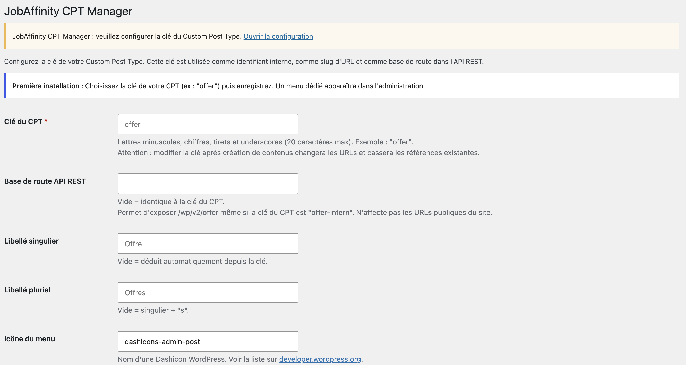

# JobAffinity CPT Manager

[](https://github.com/QuentinIS/jobaffinity-cpt-manager/actions/workflows/lint.yml)

WordPress plugin that gives JobAffinity job offers a custom post type of their
own instead of mixing them into Posts, and exposes every field JobAffinity
sends through the REST API.

The plugin is the receiving end only: it never contacts JobAffinity and makes
no outbound HTTP request of any kind. JobAffinity pushes to your site and the
plugin decides where those publications land — over the REST API, which
authenticates with a revocable application password and can target the post
type directly, or over XML-RPC for connections that predate it.

JobAffinity is an applicant tracking system published by
[Intuition Software](https://www.intuition-software.com/); the product site is
[jobaffinity.com](https://www.jobaffinity.com/). End-user documentation lives in
[`readme.txt`](readme.txt) (the wordpress.org format) and, in French, in
[`INTEGRATION-JOBAFFINITY.md`](INTEGRATION-JOBAFFINITY.md).

## Installation

Requires WordPress 5.6 and PHP 7.4.

1. Install and activate the plugin.
2. Open **Settings → JobAffinity CPT Manager** and set the post type key,
   `offer` for example. Nothing is registered until that key is set.
3. In JobAffinity, under *Admin → Publications*, point your WordPress source at
   the same key so offers land in the post type instead of in Posts.

Settle on the key before publishing: changing it later leaves existing content
on the old post type. See [Changing the post type key](#changing-the-post-type-key).



## Features

- **Configurable post type key.** After activation, *Settings → JobAffinity CPT
  Manager* lets you pick the key (`offer`, for example), the labels and the menu
  icon.
- **Behaves like native posts.** Same supports (title, editor, author,
  thumbnail, excerpt, custom-fields, comments, revisions, post-formats), same
  taxonomies (categories, tags), same capability logic via
  `capability_type => 'post'`, so administrators, editors and authors get the
  rights they already have on posts.
- **Decoupled REST route base.** The route may differ from the post type key —
  a post type keyed `offer-intern` can be served at `/wp/v2/offer` — with
  collision detection against core routes, other post types and taxonomies.
- **`easyposting_fields`, the JobAffinity channel.** One write-only REST field
  carries the complete set of fields with their names, so nothing has to be
  declared: a key added on the JobAffinity side arrives with the next
  publication. Keys in the plugin's namespace that the payload no longer carries
  are deleted.
- **22 JobAffinity keys always declared** through `register_post_meta()`, so
  they work in the standard `meta` object. Settings add keys on top; they never
  remove the required set.
- **Arbitrary fields** through a `custom_fields` REST field (aliased as
  `meta_input`), which accepts any key without pre-declaration, supports
  multi-valued keys and deletes a key when sent `null`.
- **Optional interception** of incoming XML-RPC and REST publications carrying
  a `job_id` meta, re-routing them from `post` to the custom post type. This is
  a fallback: a JobAffinity source that names the post type publishes straight
  to it and needs no interception.

## Usage

### Which channel?

|                             | `easyposting_fields`                  | `meta`                   | `custom_fields`     |
| --------------------------- | ------------------------------------- | ------------------------ | ------------------- |
| Used by                     | JobAffinity                           | generic REST clients     | older integrations  |
| WordPress standard          | no, plugin-specific                   | yes                      | no, plugin-specific |
| Accepted keys               | `job_*`, `custom_*`, `apply_url`      | declared keys only       | any key             |
| Multiple values             | no                                    | no                       | yes, indexed array  |
| Deletion                    | absent key is deleted                 | `null`                   | `null`              |
| Available on `/wp/v2/posts` | yes, if the option is on              | yes, if the option is on | no                  |

All three stay supported: sites already publishing through `meta` or
`custom_fields` need no change.

WordPress **silently ignores** an undeclared key sent in `meta`: the request
answers `201` and the field is lost. That is why the plugin declares the
configured list. To see what is actually exposed:

```bash
curl -X OPTIONS https://example.com/wp-json/wp/v2/offer \
  | python3 -c "import sys,json;print(sorted(json.load(sys.stdin)['schema']['properties']['meta']['properties']))"
```

Within one request the channels are written in the order `meta`,
`custom_fields`, `meta_input`, `easyposting_fields`: when a key arrives through
several, the last one wins.

### Create through `easyposting_fields`

```bash
curl -X POST https://example.com/wp-json/wp/v2/offer \
  -u "user:xxxx xxxx xxxx xxxx xxxx xxxx" \
  -H "Content-Type: application/json" \
  -d '{
    "title": "Sales assistant - Versailles",
    "status": "publish",
    "easyposting_fields": {
      "job_id": "1023736",
      "job_contract_type": "CDI",
      "custom_regions": "YVELINES SUD",
      "apply_url": "https://example.com/apply/976itcfhzqxldumwbv"
    }
  }'
```

- Keys must match `job_[a-z0-9_]{1,50}`, `custom_[a-z0-9_]{1,50}` or
  `apply_url`, and must not be protected meta. Anything else is ignored, so
  `_yoast_*`, ACF or WooCommerce keys are out of reach.
- Values must be scalars; they are stored as strings. A key with a non-scalar
  value is skipped and its stored value is left as it was.
- At most 100 keys. A payload that is not an object, or is larger, is rejected
  with a `400` **before** the post is created.
- **Sweep.** Every publication carries the complete state of the offer, and an
  empty value is omitted rather than sent as `""`. So after writing, every
  `job_*`, `custom_*` and `apply_url` key the payload did not carry is deleted.
  The sweep only runs when the request contains `easyposting_fields`: edits made
  in the admin, or through `meta` or `custom_fields` alone, never trigger it. A
  site that writes keys in that namespace by other means should turn the sweep
  off or narrow it with the filters below.
- The field is write-only and the keys are not declared, so nothing is added to
  the public REST output. Themes read the values with `get_post_meta()`.

### Create with declared fields

```bash
curl -X POST https://example.com/wp-json/wp/v2/offer \
  -u "user:xxxx xxxx xxxx xxxx xxxx xxxx" \
  -H "Content-Type: application/json" \
  -d '{
    "title": "Sales assistant - Versailles",
    "status": "publish",
    "meta": {
      "job_id": "1023736",
      "job_contract_type": "CDI",
      "job_salary_min": "28000"
    }
  }'
```

Every key is typed `string`. A JSON number or boolean is cast to a string
before validation; an array or object is still rejected with
`rest_invalid_type`.

### Create with arbitrary fields

```bash
curl -X POST https://example.com/wp-json/wp/v2/offer \
  -u "user:xxxx xxxx xxxx xxxx xxxx xxxx" \
  -H "Content-Type: application/json" \
  -d '{
    "title": "Spring opening",
    "status": "publish",
    "custom_fields": {
      "price": "99.90",
      "currency": "EUR",
      "internal_tags": ["promo", "new"]
    }
  }'
```

Send `null` as a value to delete a meta key.

## Security

- `custom_fields` is only returned to users who can edit the post; anonymous
  readers get `{}`. It lists every unprotected meta, and a free-form `custom_*`
  key can hold anything, a margin for instance.
- Protected meta (underscore-prefixed, such as `_wp_page_template`) is filtered
  out on read and refused on write unless the user explicitly holds the matching
  `edit_post_meta` capability.
- String values go through `wp_kses_post`, the same rule as post content. The
  keys `job_link` and `apply_url`, and any key ending in `_url` or `_link`, go
  through `esc_url_raw`, which preserves `&` in URLs.
- Sanitisation is wired through `register_post_meta()`, so it covers every write
  path at once: the `meta` object, `custom_fields`, XML-RPC and the Custom
  Fields metabox.
- Writing a declared meta requires `edit_post` on the target post, not just
  `edit_posts`.
- Indexed arrays are stored as multi-valued meta (`delete_post_meta` then a loop
  of `add_post_meta`) so `get_post_meta( $id, $key, false )` keeps working.

## Developer filters

| Filter                       | Purpose                                                                                      |
| ---------------------------- | -------------------------------------------------------------------------------------------- |
| `ccptm_meta_keys`            | Add keys to the declared list. The JobAffinity set is re-injected after the filter and cannot be removed. |
| `ccptm_meta_post_types`      | Change which post types the declarations are applied to.                                       |
| `ccptm_sanitize_meta_value`  | Customise the sanitisation of a declared meta value, and of free keys written through `easyposting_fields`. |
| `ccptm_easyposting_sweep`    | Return `false` to disable the sweep of absent keys. Receives the post ID.                      |
| `ccptm_easyposting_sweep_keys` | Remove keys from the list the sweep is about to delete. Keys added to it are ignored.       |

## Operational notes

### Multisite

Settings live in the **per-site** option `ccptm_settings`. Each site in a
network therefore has its own post type key, route base and field list — usually
what you want, since `custom_*` fields differ per site. A site with no settings
registers neither the post type nor the meta. Network activation works, but
each site still has to be configured individually.

### Changing the post type key

The key can be changed, but doing so changes the public URLs, changes the REST
route base if that field is left empty, and does not migrate existing posts:
they stay attached to the old `post_type` until migrated by hand. Settle on the
key before creating content.

### Known conflict

Do not run the `offer-xmlrpc` plugin at the same time with the key `offer`. It
registers the same post type at `init` priority 10 **without** `show_in_rest`,
overwriting this plugin's registration at priority 5 and removing the REST
route.

## Development

WordPress runs in Docker; nothing is installed on the host.

### Architecture

```
jobaffinity-cpt-manager.php       Bootstrap, activation
includes/
  class-ccptm-settings.php        Options, validation, migration
  class-ccptm-cpt.php             Post type registration (init, priority 5)
  class-ccptm-meta.php            register_post_meta() declarations
  class-ccptm-rest.php            custom_fields REST field + REST interception
  class-ccptm-easyposting.php     easyposting_fields REST field + sweep
  class-ccptm-xmlrpc.php          XML-RPC interception
  class-ccptm-admin.php           Settings screen
uninstall.php                     Per-site cleanup, content left untouched
languages/                        .pot template only; locales come from
                                  translate.wordpress.org
```

`plugins_loaded` instantiates the classes in order; `CCPTM_Settings::maybe_migrate()`
runs before `CCPTM_Meta` so the legacy `meta_keys` option is converted before
meta keys are registered on `init` priority 11.

### Commands

```bash
# Regenerate the translation template
docker run --rm -u "$(id -u):$(id -g)" -v "$PWD":/app -w /app wordpress:cli \
  wp i18n make-pot . languages/jobaffinity-cpt-manager.pot \
    --slug=jobaffinity-cpt-manager --domain=jobaffinity-cpt-manager \
    --exclude=node_modules,.github,.wordpress-org

# Syntax check
docker run --rm -v "$PWD":/app -w /app php:8.2-cli \
  sh -c 'for f in *.php includes/*.php; do php -l "$f"; done'
```

Only the `.pot` lives in this repository. Catalogues are **not** bundled: a
directory-hosted plugin gets them from
[translate.wordpress.org](https://translate.wordpress.org/), which WordPress has
loaded automatically from `WP_LANG_DIR/plugins/` since 4.6 — hence no
`load_plugin_textdomain()` call either. Translate French, or any other locale,
on translate.wordpress.org rather than committing a `.po` here.

Coding standards (`phpcs.xml.dist`) and the WordPress Plugin Check run in CI;
see `.github/workflows/lint.yml`.

### Running Plugin Check correctly

This repository **is** the plugin: the working copy sits in
`wp-content/plugins/` and is bind-mounted into the container, so editing the
repository edits the running plugin. The consequence is that running Plugin
Check from the WordPress admin inspects the working copy, development files
included, and reports `hidden_files` on `.gitignore`, `application_detected` on
`phpcs.xml.dist`, and so on. None of those files ship: `.distignore` strips
them.

Check what actually ships, from the repository root:

```bash
# Build the distribution tree, exactly as the deploy action does
rsync -a --exclude-from=.distignore ./ /tmp/build/jobaffinity-cpt-manager/

# Then point Plugin Check at it. --slug matters: without it the check derives
# the expected text domain from the directory name.
wp plugin check /tmp/build/jobaffinity-cpt-manager/jobaffinity-cpt-manager.php \
  --slug=jobaffinity-cpt-manager
```

The `lint.yml` workflow does the same on every push, so a green CI run is the
authoritative answer.

## Releasing

The two wordpress.org workflows are gated on a repository variable and do
nothing until it is set. Once the plugin is approved and its SVN repository
exists, add the `SVN_USERNAME` and `SVN_PASSWORD` secrets (with two-factor
authentication enabled, `SVN_PASSWORD` must be an SVN-specific application
password from your wordpress.org profile), then set the variable:

```bash
gh variable set WPORG_APPROVED --body true
```

Releases are then tag-driven. `Version` in the plugin header, `Stable tag` in
`readme.txt` and the git tag must all match, and tags carry **no** `v` prefix —
10up's deploy action reuses the tag name as the SVN tag directory.

```bash
git tag 1.4.0 && git push origin 1.4.0
```

### Building the submission zip

Until the plugin is approved there is no SVN repository and no deploy workflow
to build from, so the zip uploaded to "Add your plugin" is built by hand. Never
zip the working copy: the uploader rejects `.gitignore`, `.editorconfig`,
`.distignore`, `phpcs.xml.dist`, `.github/` and any markdown file other than
`readme.txt` in the plugin root. `.distignore` already lists all of them, so
build through it and the archive comes out clean:

```bash
rm -rf /tmp/dist && mkdir -p /tmp/dist/jobaffinity-cpt-manager
rsync -a --exclude-from=.distignore ./ /tmp/dist/jobaffinity-cpt-manager/
(cd /tmp/dist && zip -rqX ~/jobaffinity-cpt-manager-1.4.0.zip jobaffinity-cpt-manager)
unzip -l ~/jobaffinity-cpt-manager-1.4.0.zip
```

The plugin directory must sit at the root of the archive, so the `zip` runs
from the parent of the build tree and never from inside it. The listing should
show 11 files and nothing beginning with a dot.

## License

GPL-2.0-or-later. See [LICENSE](LICENSE).
